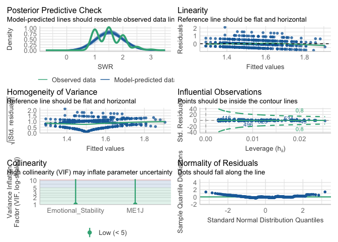
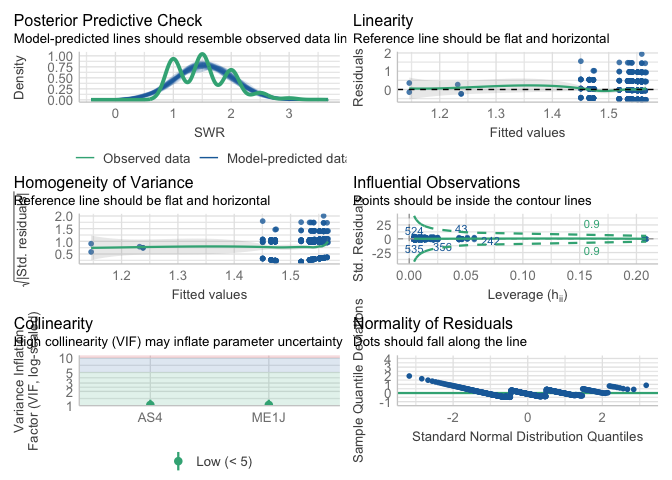

My project
================
Sabrina Xu
2024-10-10

``` r
library(haven)
library(dplyr)
```

    ## 
    ## Attaching package: 'dplyr'

    ## The following objects are masked from 'package:stats':
    ## 
    ##     filter, lag

    ## The following objects are masked from 'package:base':
    ## 
    ##     intersect, setdiff, setequal, union

``` r
library(ggplot2)

list.files("/Users/xushimin/Downloads/ICPSR_36380 2/DS0001")
```

    ## [1] "36380-0001-Codebook.pdf" "36380-0001-Data.rda"

``` r
ori_data <-load("/Users/xushimin/Downloads/ICPSR_36380 2/DS0001/36380-0001-Data.rda")
```

``` r
#Find my data

variables <- c("ME1J", "PEA14", "PEA13", "PEA18", "PEA15", "PEA12", "PEA18_1", "PEA16", "SS7", "SS20", "SEX")


found_vars <- grep(paste(variables, collapse = "|"), names(da36380.0001), value = TRUE)


print(found_vars)
```

    ##  [1] "SEX"     "SS7"     "SS20"    "PEA12"   "PEA13"   "PEA14"   "PEA15"  
    ##  [8] "PEA16"   "PEA18"   "PEA18_1" "ME1J"    "SEXDUM"

``` r
selected_data <- da36380.0001[, c("SEX", "SS7", "SS20", "PEA12", "PEA13", "PEA14", "PEA15", "PEA16", "PEA18", "PEA18_1", "ME1J", "AS4", "SEXDUM")]

head(selected_data)
```

    ##          SEX                    SS7                      SS20          PEA12
    ## 1   (1) MALE     (1) VERY SATISFIED        (1) VERY SATISFIED   (3) NOT VERY
    ## 2   (1) MALE     (1) VERY SATISFIED    (2) SOMEWHAT SATISFIED (4) NOT AT ALL
    ## 3   (1) MALE     (1) VERY SATISFIED    (2) SOMEWHAT SATISFIED   (2) SOMEWHAT
    ## 4 (2) FEMALE (2) SOMEWHAT SATISFIED    (2) SOMEWHAT SATISFIED   (3) NOT VERY
    ## 5 (2) FEMALE (2) SOMEWHAT SATISFIED (3) SOMEWHAT DISSATISFIED   (2) SOMEWHAT
    ## 6   (1) MALE (2) SOMEWHAT SATISFIED    (2) SOMEWHAT SATISFIED   (3) NOT VERY
    ##            PEA13          PEA14          PEA15          PEA16          PEA18
    ## 1   (3) NOT VERY   (2) SOMEWHAT   (3) NOT VERY (4) NOT AT ALL (4) NOT AT ALL
    ## 2 (4) NOT AT ALL (4) NOT AT ALL (4) NOT AT ALL (4) NOT AT ALL (4) NOT AT ALL
    ## 3   (3) NOT VERY (4) NOT AT ALL   (3) NOT VERY (4) NOT AT ALL (4) NOT AT ALL
    ## 4   (2) SOMEWHAT       (1) VERY   (3) NOT VERY   (2) SOMEWHAT (4) NOT AT ALL
    ## 5   (3) NOT VERY   (2) SOMEWHAT   (2) SOMEWHAT   (2) SOMEWHAT   (2) SOMEWHAT
    ## 6   (2) SOMEWHAT   (3) NOT VERY (4) NOT AT ALL   (3) NOT VERY   (3) NOT VERY
    ##          PEA18_1          ME1J     AS4     SEXDUM
    ## 1 (4) NOT AT ALL         (2) 2 (2) B S   (0) male
    ## 2 (4) NOT AT ALL (1) 1 OR LESS (2) B S   (0) male
    ## 3 (4) NOT AT ALL (1) 1 OR LESS (2) B S   (0) male
    ## 4 (4) NOT AT ALL          <NA> (2) B S (1) female
    ## 5   (2) SOMEWHAT (1) 1 OR LESS (2) B S (1) female
    ## 6       (1) VERY         (2) 2 (2) B S   (0) male

``` r
selected_data <- selected_data %>%
  mutate(Emotional_Stability = rowMeans(cbind(PEA14, PEA13, PEA18, PEA15, PEA12, PEA18_1, PEA16)),
        SWR = rowMeans(cbind(SS7,SS20)))

head(selected_data)
```

    ##          SEX                    SS7                      SS20          PEA12
    ## 1   (1) MALE     (1) VERY SATISFIED        (1) VERY SATISFIED   (3) NOT VERY
    ## 2   (1) MALE     (1) VERY SATISFIED    (2) SOMEWHAT SATISFIED (4) NOT AT ALL
    ## 3   (1) MALE     (1) VERY SATISFIED    (2) SOMEWHAT SATISFIED   (2) SOMEWHAT
    ## 4 (2) FEMALE (2) SOMEWHAT SATISFIED    (2) SOMEWHAT SATISFIED   (3) NOT VERY
    ## 5 (2) FEMALE (2) SOMEWHAT SATISFIED (3) SOMEWHAT DISSATISFIED   (2) SOMEWHAT
    ## 6   (1) MALE (2) SOMEWHAT SATISFIED    (2) SOMEWHAT SATISFIED   (3) NOT VERY
    ##            PEA13          PEA14          PEA15          PEA16          PEA18
    ## 1   (3) NOT VERY   (2) SOMEWHAT   (3) NOT VERY (4) NOT AT ALL (4) NOT AT ALL
    ## 2 (4) NOT AT ALL (4) NOT AT ALL (4) NOT AT ALL (4) NOT AT ALL (4) NOT AT ALL
    ## 3   (3) NOT VERY (4) NOT AT ALL   (3) NOT VERY (4) NOT AT ALL (4) NOT AT ALL
    ## 4   (2) SOMEWHAT       (1) VERY   (3) NOT VERY   (2) SOMEWHAT (4) NOT AT ALL
    ## 5   (3) NOT VERY   (2) SOMEWHAT   (2) SOMEWHAT   (2) SOMEWHAT   (2) SOMEWHAT
    ## 6   (2) SOMEWHAT   (3) NOT VERY (4) NOT AT ALL   (3) NOT VERY   (3) NOT VERY
    ##          PEA18_1          ME1J     AS4     SEXDUM Emotional_Stability SWR
    ## 1 (4) NOT AT ALL         (2) 2 (2) B S   (0) male            3.285714 1.0
    ## 2 (4) NOT AT ALL (1) 1 OR LESS (2) B S   (0) male            4.000000 1.5
    ## 3 (4) NOT AT ALL (1) 1 OR LESS (2) B S   (0) male            3.428571 1.5
    ## 4 (4) NOT AT ALL          <NA> (2) B S (1) female            2.714286 2.0
    ## 5   (2) SOMEWHAT (1) 1 OR LESS (2) B S (1) female            2.142857 2.5
    ## 6       (1) VERY         (2) 2 (2) B S   (0) male            2.714286 2.0

``` r
ggplot(selected_data, aes(x = Emotional_Stability)) + 
  geom_histogram(binwidth = 0.5, fill = "skyblue") + 
  theme_classic()
```

    ## Warning: Removed 9 rows containing non-finite outside the scale range
    ## (`stat_bin()`).

<!-- -->

``` r
ggplot(selected_data, aes(x = Emotional_Stability)) + 
  geom_density(adjust = 1.5, fill = "skyblue", alpha = 0.4) + 
  theme_classic()
```

    ## Warning: Removed 9 rows containing non-finite outside the scale range
    ## (`stat_density()`).

<!-- -->

``` r
qq <- ggplot(selected_data, aes(sample = Emotional_Stability)) + 
  geom_qq() + 
  geom_qq_line() + 
  theme_classic()

# Normality test (Shapiro-Wilk)
shapiro.test(selected_data$Emotional_Stability)
```

    ## 
    ##  Shapiro-Wilk normality test
    ## 
    ## data:  selected_data$Emotional_Stability
    ## W = 0.96163, p-value < 2.2e-16

``` r
#data trransfromation

selected_data$Emotional_Stability_log <- log10(selected_data$Emotional_Stability + 1)
```

``` r
#chenck normality again
ggplot(selected_data, aes(x = Emotional_Stability_log)) + 
  geom_histogram(binwidth = 0.25, fill = "skyblue") + 
  theme_classic()
```

    ## Warning: Removed 9 rows containing non-finite outside the scale range
    ## (`stat_bin()`).

<!-- -->

``` r
ggplot(selected_data, aes(x = Emotional_Stability_log)) + 
  geom_density(adjust = 1.5, fill = "skyblue", alpha = 0.4) + 
  theme_classic()
```

    ## Warning: Removed 9 rows containing non-finite outside the scale range
    ## (`stat_density()`).

<!-- -->

``` r
qq <- ggplot(selected_data, aes(sample = Emotional_Stability_log)) + 
  geom_qq() + 
  geom_qq_line() + 
  theme_classic()

# Normality test (Shapiro-Wilk)
shapiro.test(selected_data$Emotional_Stability_log)
```

    ## 
    ##  Shapiro-Wilk normality test
    ## 
    ## data:  selected_data$Emotional_Stability_log
    ## W = 0.92849, p-value < 2.2e-16

``` r
#sqrt trans
selected_data$Emotional_Stability_sqrt <- sqrt(selected_data$Emotional_Stability + 1)

shapiro.test(selected_data$Emotional_Stability_sqrt)
```

    ## 
    ##  Shapiro-Wilk normality test
    ## 
    ## data:  selected_data$Emotional_Stability_sqrt
    ## W = 0.94838, p-value < 2.2e-16

``` r
library(haven)
library(bruceR)
```

    ## 
    ## bruceR (v2024.6)
    ## Broadly Useful Convenient and Efficient R functions
    ## 
    ## Packages also loaded:
    ## ✔ data.table ✔ emmeans
    ## ✔ dplyr      ✔ lmerTest
    ## ✔ tidyr      ✔ effectsize
    ## ✔ stringr    ✔ performance
    ## ✔ ggplot2    ✔ interactions
    ## 
    ## Main functions of `bruceR`:
    ## cc()             Describe()  TTEST()
    ## add()            Freq()      MANOVA()
    ## .mean()          Corr()      EMMEANS()
    ## set.wd()         Alpha()     PROCESS()
    ## import()         EFA()       model_summary()
    ## print_table()    CFA()       lavaan_summary()
    ## 
    ## For full functionality, please install all dependencies:
    ## install.packages("bruceR", dep=TRUE)
    ## 
    ## Online documentation:
    ## https://psychbruce.github.io/bruceR
    ## 
    ## To use this package in publications, please cite:
    ## Bao, H.-W.-S. (2024). bruceR: Broadly useful convenient and efficient R functions (Version 2024.6) [Computer software]. https://CRAN.R-project.org/package=bruceR

    ## 
    ## These packages are dependencies of `bruceR` but not installed:
    ## - pacman, openxlsx, ggtext, lmtest, vars, phia, MuMIn, GGally
    ## 
    ## ***** Install all dependencies *****
    ## install.packages("bruceR", dep=TRUE)

``` r
library(dplyr)
library(ggstatsplot)
```

    ## You can cite this package as:
    ##      Patil, I. (2021). Visualizations with statistical details: The 'ggstatsplot' approach.
    ##      Journal of Open Source Software, 6(61), 3167, doi:10.21105/joss.03167

``` r
library(performance)
library(sjPlot)

#step 1: build a model
model<-lm(SWR ~ Emotional_Stability + ME1J, data = selected_data)


#step 2: check the assumptions
check_model(model)
```

<!-- -->

``` r
#step 3: summarize results; add ,std = TRUE if you want to get standardized coefficients
model_summary(model)
```

    ## 
    ## Model Summary
    ## 
    ## ────────────────────────────────
    ##                      (1) SWR    
    ## ────────────────────────────────
    ## (Intercept)            2.078 ***
    ##                       (0.093)   
    ## Emotional_Stability   -0.172 ***
    ##                       (0.029)   
    ## ME1J(2) 2             -0.010    
    ##                       (0.046)   
    ## ME1J(3) 3-4           -0.099    
    ##                       (0.057)   
    ## ME1J(4) 5+             0.008    
    ##                       (0.068)   
    ## ────────────────────────────────
    ## R^2                    0.054    
    ## Adj. R^2               0.048    
    ## Num. obs.            658        
    ## ────────────────────────────────
    ## Note. * p < .05, ** p < .01, *** p < .001.
    ## 
    ## # Check for Multicollinearity
    ## 
    ## Low Correlation
    ## 
    ##                 Term  VIF       VIF 95% CI Increased SE Tolerance
    ##  Emotional_Stability 1.00 [1.00, 2.56e+07]         1.00      1.00
    ##                 ME1J 1.00 [1.00, 2.56e+07]         1.00      1.00
    ##  Tolerance 95% CI
    ##      [0.00, 1.00]
    ##      [0.00, 1.00]

``` r
#step 4: plot the results; change type ="est" to type = "std" if you want to plot the standardized coefficients
plot_model(model,  type ="est",  show.values = TRUE, vline.color = "#1B191999", line.size = 1.5, dot.size = 2.5, colors = "blue") + theme_bruce()
```

<!-- -->

``` r
library(haven)
library(bruceR)
library(dplyr)
library(ggstatsplot)
library(performance)
library(sjPlot)

#step 1: build a model
model<-lm(SWR ~ AS4 + ME1J, data = selected_data)


#step 2: check the assumptions
check_model(model)
```

<!-- -->

``` r
#step 3: summarize results; add ,std = TRUE if you want to get standardized coefficients
model_summary(model)
```

    ## 
    ## Model Summary
    ## 
    ## ──────────────────────────────────
    ##                        (1) SWR    
    ## ──────────────────────────────────
    ## (Intercept)              1.537 ***
    ##                         (0.049)   
    ## AS4(2) B S               0.022    
    ##                         (0.053)   
    ## AS4(3) C S               0.015    
    ##                         (0.057)   
    ## AS4(4) D S               0.024    
    ##                         (0.109)   
    ## AS4(5) FAILING GRADES   -0.305    
    ##                         (0.223)   
    ## ME1J(2) 2               -0.018    
    ##                         (0.048)   
    ## ME1J(3) 3-4             -0.086    
    ##                         (0.058)   
    ## ME1J(4) 5+               0.006    
    ##                         (0.071)   
    ## ──────────────────────────────────
    ## R^2                      0.008    
    ## Adj. R^2                -0.003    
    ## Num. obs.              659        
    ## ──────────────────────────────────
    ## Note. * p < .05, ** p < .01, *** p < .001.
    ## 
    ## # Check for Multicollinearity
    ## 
    ## Low Correlation
    ## 
    ##  Term  VIF   VIF 95% CI Increased SE Tolerance Tolerance 95% CI
    ##   AS4 1.04 [1.00, 1.33]         1.02      0.96     [0.75, 1.00]
    ##  ME1J 1.04 [1.00, 1.33]         1.02      0.96     [0.75, 1.00]

``` r
#step 4: plot the results; change type ="est" to type = "std" if you want to plot the standardized coefficients
plot_model(model,  type ="est",  show.values = TRUE, vline.color = "#1B191999", line.size = 1.5, dot.size = 2.5, colors = "blue") + theme_bruce()
```

<!-- -->
